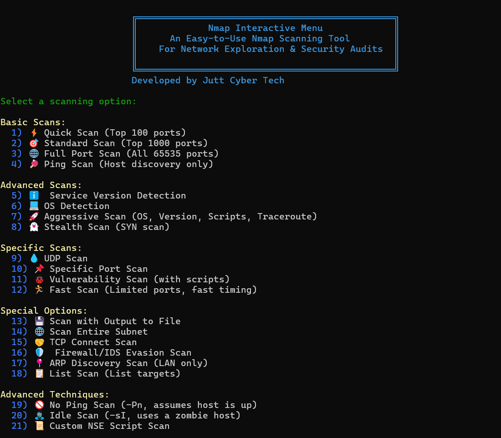

# 🔍 Nmap Interactive Menu

## 📸 Screenshot  
<p align="center">
  
</p>

## An Easy-to-Use Nmap Scanning Tool for Network Exploration & Security Audits

This Bash-based interactive tool simplifies advanced Nmap commands into a clean, user-friendly terminal menu. It allows both beginners and professionals to perform powerful network reconnaissance and security audits without typing long command lines.

---

## 🚀 Features

### 🔹 Basic Scans
- Quick Scan — Top 100 ports  
- Standard Scan — Top 1000 ports  
- Full Port Scan — All 65535 ports  
- Ping Scan — Host discovery  

### 🔹 Advanced Scans
- Service Version Detection  
- OS Detection  
- Aggressive Scan (OS, Version, Scripts, Traceroute)  
- Stealth SYN Scan  

### 🔹 Specific Scans
- UDP Scan  
- Scan Specific Ports  
- Vulnerability Scan (NSE scripts)  
- Fast Scan (faster, limited ports)  

### 🔹 Special Options
- Save Scan Output (nmap, xml, gnmap)  
- Scan Entire Subnet  
- TCP Connect Scan  
- Firewall / IDS Evasion Scan  
- ARP Discovery (LAN)  
- List Scan (No packets sent)  

### 🔹 Advanced Techniques
- No Ping Scan (-Pn)  
- Idle Scan (-sI zombie technique)  
- Custom NSE Script Scan  
- **All-in-One Full Audit Scan**  
  - OS detection  
  - Version detection  
  - Full port scan  
  - Multiple NSE script categories  
  - Saves full report with timestamp  

---

## 📦 Prerequisites

Install Nmap:

### Ubuntu/Debian
```bash
sudo apt update && sudo apt install nmap
```

### CentOS/RHEL
```bash
sudo yum install nmap
```

### macOS (Homebrew)
```bash
brew install nmap
```

---

## 📥 Installation

### Option 1 — Clone with Git
```bash
git clone https://github.com/juttcybertech/Nmap-Interactive-Menu.git
```

### Option 2 — Direct Download  
Download `nmap_menu.sh` from the repo.

---

## ▶️ Usage

1. Make the script executable:
```bash
chmod +x nmap_menu.sh
```

2. Run it:
```bash
sudo ./nmap_menu.sh
```

---

## 👨‍💻 Developer  
**Jutt Cyber Tech**
