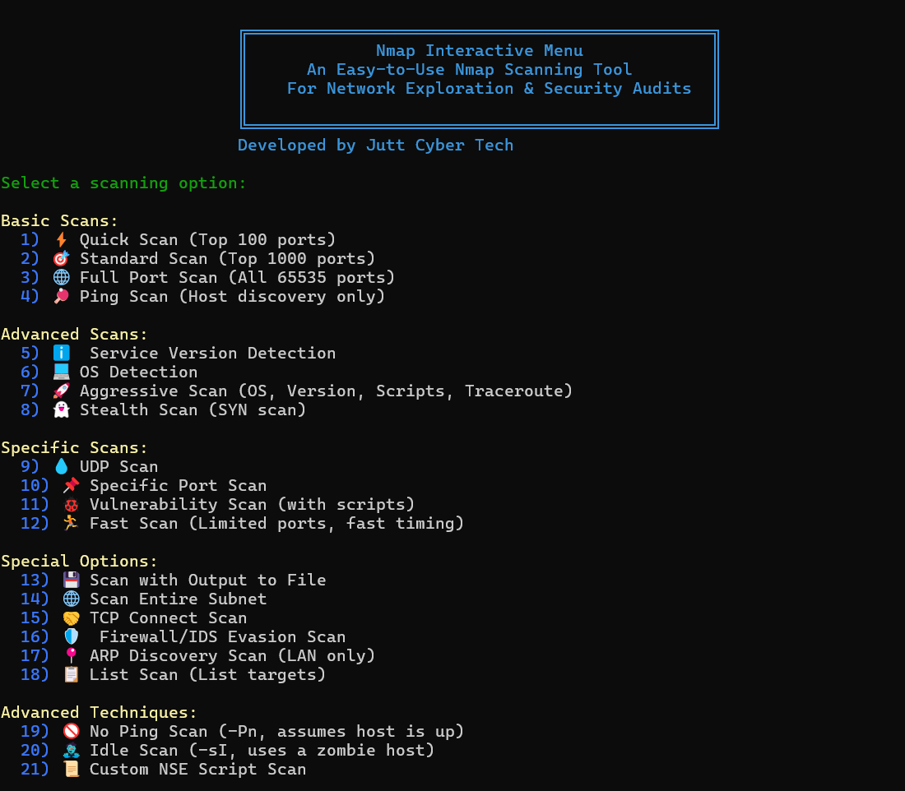

# 🔍 Nmap Interactive Menu

<p align="center">
  
  
  
  
  <br>
  
  
  
</p>

---

## 📖 Overview

**Nmap Interactive Menu** is a high-performance, terminal-based utility designed to streamline network reconnaissance and security auditing. It simplifies complex Nmap commands into an intuitive, interactive menu system, allowing security professionals and network administrators to execute advanced scans with precision and speed.

> *Empowering network exploration through automation and clarity.*

---

## 📸 Preview

<p align="center">
  
  <br>
  <i>Sleek, interactive terminal interface designed for streamlined workflows.</i>
</p>

---

## ✨ Features

### 🛡️ Scanning Suites
*   **🔹 Basic Scans**: Quick (Top 100), Standard (Top 1000), Full Port (65535), and Ping Scans.
*   **🔹 Advanced Detection**: Service Version Fingerprinting, OS Detection, and Aggressive T6 timing scans.
*   **🔹 Stealth Operations**: SYN Stealth scans and Firewall/IDS evasion techniques.
*   **🔹 Specialized Probes**: UDP scanning, ARP Discovery (LAN), and List scanning (Passive).

### ⚙️ Professional Capabilities
*   **📊 Vulnerability Auditing**: Integrated NSE (Nmap Scripting Engine) module for security flaw detection.
*   **📂 Multi-Format Output**: Save results in `.nmap`, `.xml`, and `.gnmap` formats simultaneously.
*   **🌐 Subnet Discovery**: Automated scanning across entire network ranges.
*   **🚀 Fast-Track Execution**: Optimized performance settings for rapid reconnaissance.

### 🍱 All-in-One Full Audit
Experience a comprehensive security sweep including:
- OS & Version detection
- Full port enumeration
- Comprehensive NSE script categories
- Timestamped auto-generation of full reports

---

## 🛠️ Prerequisites

Ensure you have **Nmap** installed on your system. Run the command matching your OS:

| Distribution | Command |
| :--- | :--- |
| **Debian/Ubuntu/Kali** | `sudo apt update && sudo apt install nmap` |
| **CentOS/RHEL** | `sudo yum install nmap` |
| **macOS (Homebrew)** | `brew install nmap` |

---

## 🚀 Installation & Launch

Follow these steps for a quick installation:

### 1. Clone the Environment
```bash
git clone https://github.com/juttcybertech/Nmap-Interactive-Menu.git
cd Nmap-Interactive-Menu
```

### 2. Permissions & Execution
```bash
chmod +x nmap_menu.sh
sudo ./nmap_menu.sh
```

---

## ⚖️ Legal & Ethical Usage

> [!IMPORTANT]
> This tool is strictly for **authorized security testing and educational purposes**. Using this tool against targets without prior written consent is illegal. The developers assume no liability for misuse, data loss, or network disruption. Stay ethical. Stay legal.

---

<p align="center">
  <b>Developed by Jutt Cyber Tech</b><br>
  <i>Securing the perimeter, one scan at a time.</i>
</p>
